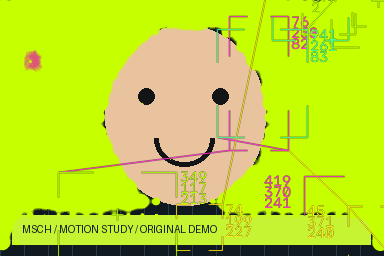

# MSCH Synkit FX

Animated metaball halftones and feature-tracking HUD boxes with labels, connectors, native VIDEO and overlay masks.

[Node reference](docs/NODES.md) · [Example workflows and results](examples/README.md) · [Publishing guide](PUBLISHING.md)



[Play / download the rendered demo](examples/results/demo.mp4)

## Included nodes

| Node | What it does |
|---|---|
| [SynkitFX Metablob](docs/NODES.md#synkitmetablob) | Build a square or hexagonal grid whose dot sizes respond to luminance, saturation or edges, then merge neighboring dots into metaball shapes. |
| [SynkitFX Tracker](docs/NODES.md#synkittracker) | Detect graphic feature points and place animated boxes, corner brackets, labels and connecting wires over the image. |

## Installation

Clone into `ComfyUI/custom_nodes`:

```bash
git clone https://github.com/mariobilly/msch-synkitfx.git
```

Open a terminal in the cloned folder and install requirements using **the same Python environment as ComfyUI**:

```bash
python -m pip install -r requirements.txt
```

Windows portable, from `ComfyUI_windows_portable`:

```powershell
.\python_embeded\python.exe -m pip install -r .\ComfyUI\custom_nodes\msch-synkitfx\requirements.txt
```

Restart ComfyUI and refresh the browser. Load a JSON workflow from `examples/` and select the supplied demo input or your own media. Keep only one installed copy of each package to avoid duplicate node registrations.

## Requirements and behavior

Two chainable CPU effects. Use the frames output between effects and VIDEO for Save Video. Masks describe overlay coverage; transparent_black is an RGB background setting, not alpha in an MP4. Tracker boxes are graphic feature overlays rather than semantic object recognition. Use even image dimensions for H.264.

## Documentation and examples

[docs/NODES.md](docs/NODES.md) documents every input, default, range, choice and output. [examples/README.md](examples/README.md) explains which inputs and other nodes each workflow needs and how the included results were produced.

## ComfyUI Manager

The release includes Comfy Registry metadata and a GitHub publishing action. **Version 0.1.0 was uploaded successfully to [Comfy Registry](https://registry.comfy.org/nodes/msch-synkitfx) under publisher `mariobilly` on 2026-09-06.** Registry reported `Pending` at verification; Manager installation availability is not yet confirmed. A separate [ComfyUI Manager node-list registration](https://github.com/Comfy-Org/ComfyUI-Manager/pull/3247) has been submitted; listing is pending maintainer acceptance. Git installation works independently. See [PUBLISHING.md](PUBLISHING.md).

## Validation

Imports and input schemas were checked against the local ComfyUI environment with Python 3.12.10, PyTorch 2.10 and CUDA available. Example render coverage is documented per workflow; this is not a claim of compatibility testing on every platform or of full MiniMax H3 model-generation validation.

## License

Project code: [MIT](LICENSE). Third-party assets and optional model weights keep their own licenses.
