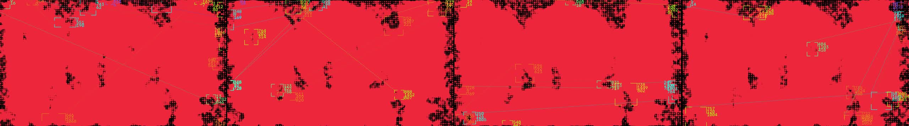
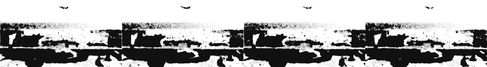
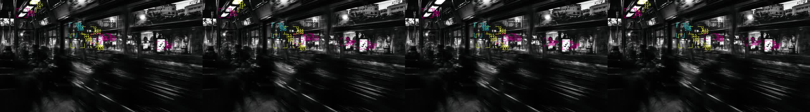
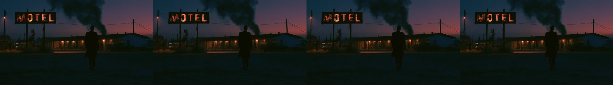

# MSCH Synkit FX showcase

Examples supplied by Mario from the MSCH Node Showcase collection. The output files are preserved as supplied.

Two chainable nodes recreating the Synkit look: a dot grid whose size follows the image, fused into blobs with a metaball field, plus HUD tracking boxes with labels, crosshairs and connection lines. Still in -> animated VIDEO out.

- red_moon_blob_tracker.mp4 - Metablob (drive=bright, red on black, merge 0.65) chained into Tracker (neon palette, 14 boxes, hop+jitter)
- motel_hex_metablob.mp4 - Metablob alone, hex grid, acid dots over the original, pulse+drift
- city_tracker_only.mp4 - Tracker alone, corner detector, CMYK palette, track+jitter with nearest-neighbour wiring

## Gallery

Click a video preview to open its file on GitHub, or use the download link.

### Beach dark blobs on white

[Open MP4](outputs/beach_dark_blobs_on_white_00001_.mp4) · [Download original](https://github.com/mariobilly/msch-synkitfx/raw/refs/heads/main/examples/showcase/outputs/beach_dark_blobs_on_white_00001_.mp4)

### City tracker only

[Open MP4](outputs/city_tracker_only_00002_.mp4) · [Download original](https://github.com/mariobilly/msch-synkitfx/raw/refs/heads/main/examples/showcase/outputs/city_tracker_only_00002_.mp4)

### Motel hex metablob

[Open MP4](outputs/motel_hex_metablob_00001_.mp4) · [Download original](https://github.com/mariobilly/msch-synkitfx/raw/refs/heads/main/examples/showcase/outputs/motel_hex_metablob_00001_.mp4)

### Red moon blob tracker

[Open MP4](outputs/red_moon_blob_tracker_00001_.mp4) · [Download original](https://github.com/mariobilly/msch-synkitfx/raw/refs/heads/main/examples/showcase/outputs/red_moon_blob_tracker_00001_.mp4)

## API workflows

These JSON files are ComfyUI API prompts, not canvas-format workflows. Send one as the `prompt` field of a `/prompt` request, or use a tool that accepts API workflows. A canvas importer may require conversion.

Choose your own source media and installed models before running. Source photos, video clips, audio and model weights are not bundled in this showcase. The supplied render settings and connections are retained; machine-specific absolute paths in the API copies use `INPUT_ROOT/` or `LOCAL_FILES/` placeholders. Replace these with paths valid on your computer.

- [synkit_api.json](workflows_api/synkit_api.json): `LoadImage`, `SaveVideo`, `SynkitMetablob`, `SynkitTracker`.

### Input files and models

| Workflow | Node | Input | Source selection |
|---|---|---|---|
| `synkit_api.json` | `1` | `image` | `msch_showcase/stills/red_moon.jpg` |
| `synkit_api.json` | `5` | `image` | `msch_showcase/stills/motel.jpg` |
| `synkit_api.json` | `11` | `image` | `msch_showcase/stills/beach_bird.jpg` |
| `synkit_api.json` | `8` | `image` | `msch_showcase/stills/city_blur.jpg` |

## Source notes

The collection notes identify images from the Jim Morrison image library, Mario’s clips, and the Suno track “Crushing Syncopation”. Those source assets are not included separately. The rendered media is supplied as showcase material; the repository’s MIT license describes the node code and does not establish a separate license for underlying media.
